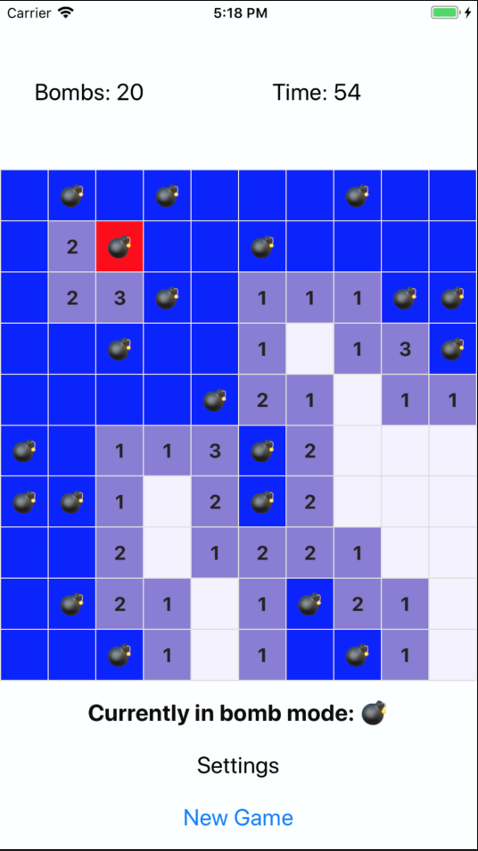

## Team Members:  created by: Daniil Kernazhytski and Alberto Clara

## Rules:

Minesweeper Game 

Standard Rules Except:
1. You loose if the time runs out
2. You loose if you shake the device
3. You loose if you click on a mine

You win When:
1. The time has not ran out AND
2. Every tile that is not a mine is revealed 

## Screenshots

